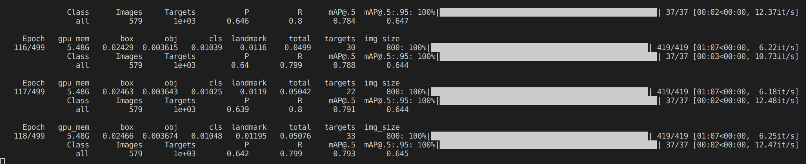
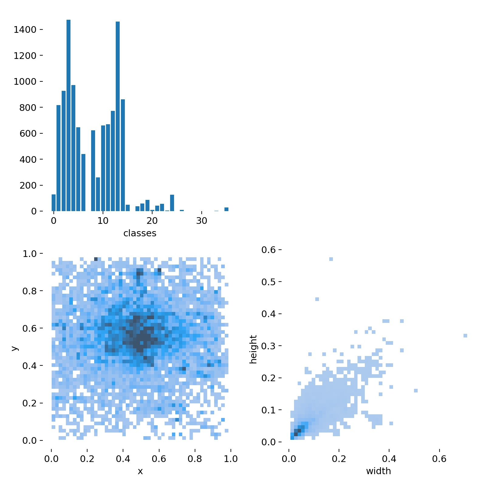

# RoboMaster装甲板识别
## 使用Yolov5-face
参考网上资源，训练模型，检测四个关键点    
训练500次
## 未使用传统算法
- 不知道敌人什么颜色的话，没分离色彩通道不是很好对图像进行处理
- 图片已经给出，曝光度不好调整
- 尝试后效果不好，我太菜了。。
- 观察出所给附件似乎是部分数据集
## 不足
- 数据集过少   
- 完全没有紫色，但是训练时有这个标签，不知道有无影响
- 熄灭类别过少，识别出来以容易被认成蓝色
- 数据集大多数为小物体。。。（能否将目标缩小，嵌入纯黑图片中识别，再取出，同比例缩放回原图）（不过感觉还是添加数据集靠谱）
- 集中在视角正中心
- 近处识别不出，近处数据集过少
- 使用python似乎效率不高
    
## Time Spent
2023.12.18--2023.12.21
## Learned
- Yolo粗浅使用  
- Opencv图像处理

## Info
<!--挂github记得把Info删了-->
姓名：凌建杰
学号：2023311C08

