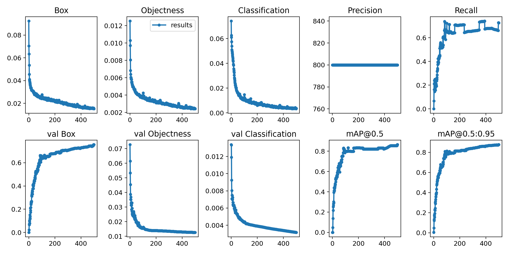
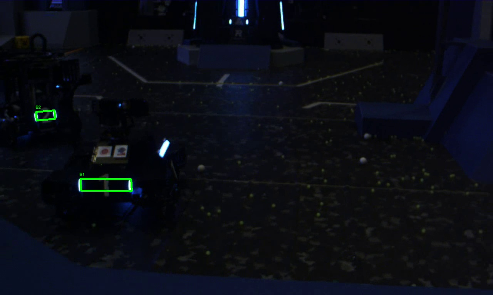
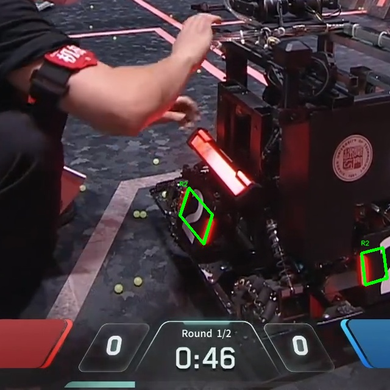
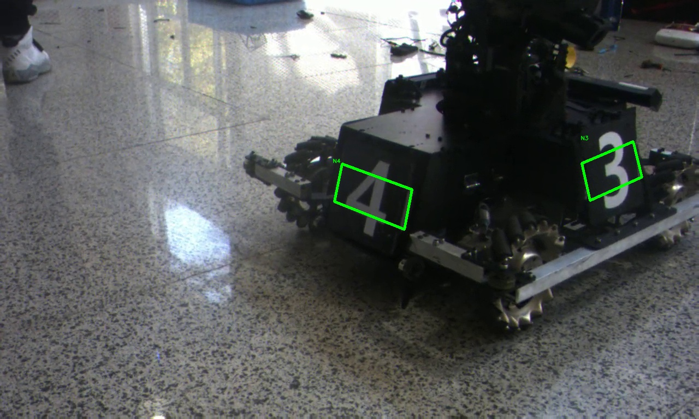
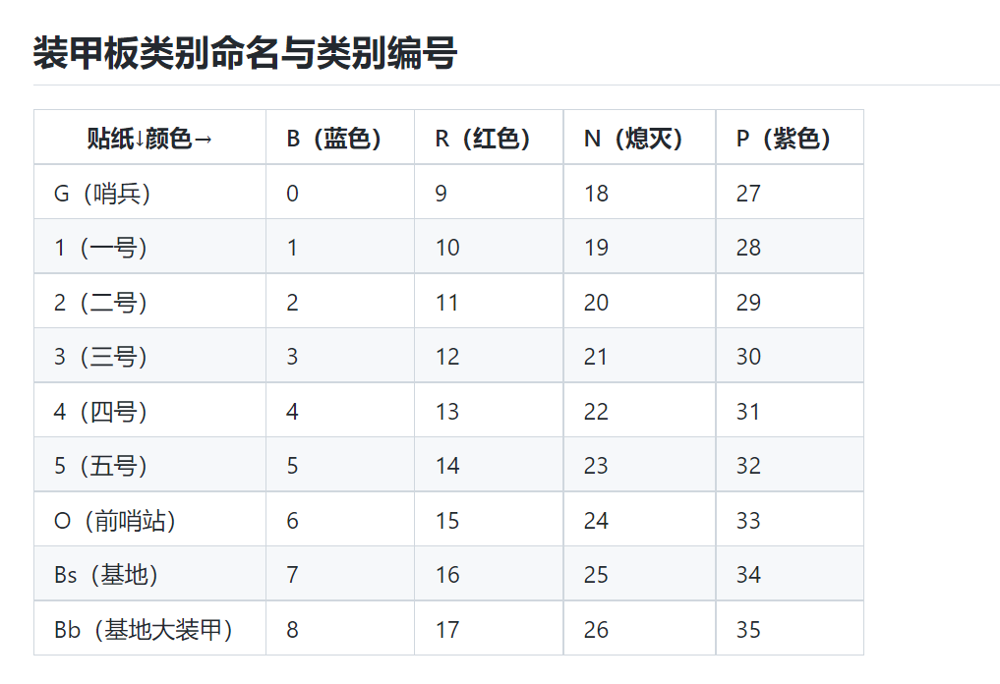

# RoboMaster装甲板识别
## 使用Yolov5-face
参考网上资源，训练模型，检测四个关键点    
训练500次(算力云上租的3080Ti)

</img>
## 使用
运行`detect.py`即可(没用argparse)
## 未使用传统算法
- 不知道敌人什么颜色的话，没分离色彩通道不是很好对图像进行处理
- 图片已经给出，曝光度不好调整
- 尝试后效果不好，我太菜了。。
- 观察出所给附件似乎是部分数据集

## Results
正常可识别  
</img>

网上找的  
</img>

部分遮挡可识别  
</img>

熄灭可识别(识别率低)  
</img>

## 不足
- 数据集过少(标数据集太耗时间了0.0)
- 可能需要删除一些无目标的数据
- 完全没有紫色，但是训练时有这个标签，不知道有无影响
- 熄灭类别过少，识别出来以容易被认成蓝色
- ~~数据集大多数为小物体。。。（能否将目标缩小，嵌入纯黑图片中识别，再取出，同比例缩放回原图）~~（不过感觉还是添加数据集靠谱）
- 集中在视角正中心(大部分数据来自摄像头记录，有操作手情况下，敌人大多位于正中心)
- 近处识别不出，近处数据集过少
- 使用python似乎效率不高

</img>
</img>

## How to use
`conda create -n <name> python=3.10`name是虚拟环境的名字，你自己定 
`conda activate <name>` 
`pip install -r requirements.txt` 

## Package
- Python==3.10(版本高了报一堆错0.0)
- torch==2.0.0+cu117
- torchaudio==2.0.1+cu117
- torchvision==0.15.1+cu117
- CUDA==12.1
- Yolov5

## Problems
- 颜色识别好像B和R搞反了(于是我手动把B和R对应标签改了一下)，大概是BGR格式的原因
- 有个别V3.0可以识别，而V4.0识别不出,但识别率V4.0高于V3.0
- 又找到了某个战队的数据集，有三万多个，炼起来mAP到0.6多就收敛了，还不如V4.0,估计是数据集标注不同
- 如果检测不出来，把置信度阈值调低可能就出来了(0.0)
## Time Spent
2023.12.18--2023.12.21
## Learned
- Yolo粗浅使用  
- Opencv图像处理(尝试过传统算法)
- ~~熟练掌握各种包的安装与卸载~~

## Info
**HITSZ**-2023  
`2023311C08`

